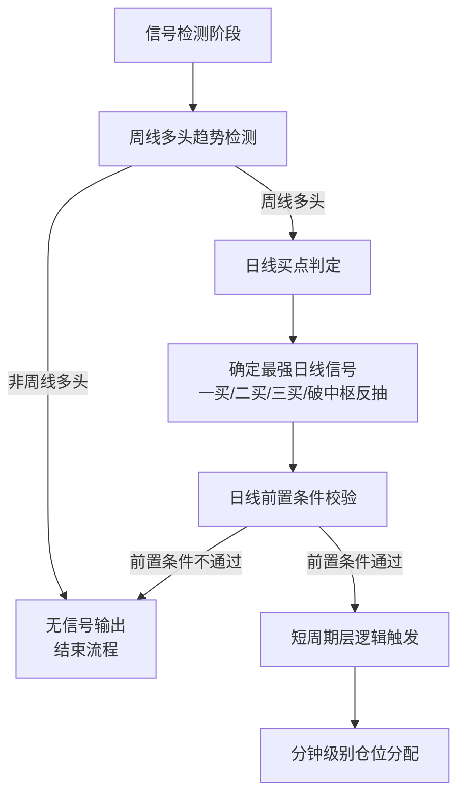
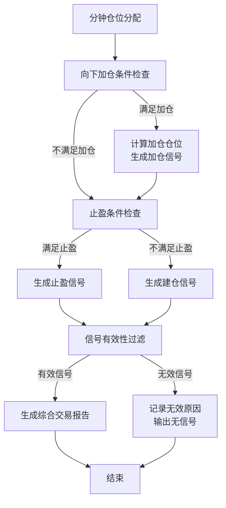

# ETF量化交易框架实现逻辑

## 一、整体架构概述

本ETF量化交易框架基于缠论理论构建，采用"长周期定方向，中周期找买点，短周期精准切入"的三层分析架构，实现了从数据获取、信号检测到交易决策的完整流程。框架以模块化设计为核心，各功能模块独立且可扩展，便于维护和优化。

## 二、核心执行流程

### 1. 数据获取与准备阶段

```mermaid
flowchart TD
    A[开始] --> B[获取日线数据]
    A --> C[获取周线数据]
    A --> D[获取分钟级别数据
    (30min/15min/5min)]
    B --> E[数据有效性校验]
    C --> E
    D --> E
    E -->|数据有效| F[进入信号检测阶段]
    E -->|数据无效| G[返回错误信息
    并记录日志]
```

### 2. 信号检测与分析阶段



### 3. 交易决策与风险控制阶段



## 三、关键模块功能说明

### 1. 数据层模块

- **DataFetcher**：负责从数据源获取日线、周线和分钟级别数据
- **DataValidator**：验证数据完整性和有效性（日线≥60根，周线≥52根）
- **DataProcessor**：对原始数据进行清洗、格式化和预处理

### 2. 信号检测模块

- **WeeklyTrendDetector**：检测周线多头趋势，基于价格趋势和MACD形态
- **DailyBuySignalDetector**：检测日线级别的一买、二买、三买和破中枢反抽信号
- **DivergenceDetector**：检测MACD背驰信号（目前主要用于日线）
- **DailyPreconditionChecker**：执行日线前置条件校验，控制短周期层逻辑触发

### 3. 交易决策模块

- **MinutePositionAllocator**：基于分钟级别数据进行精准的仓位分配
- **ShortCycleTradeLogic**：短周期交易逻辑，根据日线信号类型调整交易策略
- **PositionAdditionRules**：向下加仓规则，控制加仓时机和仓位
- **ProfitTakingRules**：止盈规则，基于日线顶背驰和分钟级别顶分型

### 4. 风险控制模块

- **InvalidSignalFilter**：过滤无效信号，提高信号质量
- **SignalValidator**：验证信号的有效性和可靠性

### 5. 输出与报告模块

- **SignalFormatter**：格式化交易信号和报告
- **Reporter**：生成综合交易报告
- **Notifier**：发送交易信号通知（可选）

## 四、关键执行逻辑详解

### 1. 周线趋势检测逻辑

周线趋势检测主要基于以下三个核心条件：

1. **价格趋势判定**：
   - 近10周内≥6根周线收盘价抬升
   - 最近一根周线收盘价高于前一根周线收盘价

2. **MACD位置判定**：
   - MACD黄白线在0轴上方
   - MACD红柱持续稳定

3. **综合评分机制**：
   - 根据上述条件的满足程度计算综合评分
   - 评分≥70分判定为周线多头趋势

### 2. 日线买点判定逻辑

日线买点检测实现了完整的缠论买点判定：

- **一买**：趋势背驰点，基于MACD底背驰和价格创新低
- **二买**：一买后的回调点，不创新低且MACD形成底背驰
- **三买**：中枢上移后的回调点，不回到原中枢
- **破中枢反抽**：有效中枢破位后的反抽点，需满足破位和反抽双重验证

### 3. 日线前置条件校验逻辑

日线前置条件校验是框架的核心控制机制，实现了时间控制和状态缓存：

1. **时间控制**：
   - 交易时间（9:30-15:00）：从缓存读取前置条件状态
   - 收盘后（15:00-15:30）：执行前置条件校验并保存结果

2. **校验条件**：
   - 中枢有效性验证
   - 信号基础状态（潜在监控/完全无效）
   - 波动等级判定（高/中/低波动）
   - 数据完整度检查

3. **状态缓存**：
   - 将校验结果保存到缓存文件
   - 交易时间直接读取缓存，避免重复计算

### 4. 短周期层交易逻辑

短周期层基于日线信号类型和分钟级别数据进行精准交易：

1. **信号类型匹配**：
   - 二买信号：优先匹配30分钟向上笔
   - 一买/三买：优先匹配15分钟向上笔
   - 破中枢反抽：低优先级分配

2. **仓位分配机制**：
   - 根据日线信号强度确定基础仓位
   - 根据分钟级别信号精确调整仓位比例
   - 实现子仓位的精细化管理

### 5. 风险控制逻辑

框架实现了多层次的风险控制机制：

1. **无效信号过滤**：
   - 过滤周线非多头信号
   - 过滤数据不完整的信号
   - 过滤不符合缠论结构的信号

2. **止损止盈机制**：
   - 基于中枢下沿的动态止损
   - 基于中枢中轨的止盈策略
   - 基于背驰的动态止盈

3. **仓位管理**：
   - 单次仓位限制
   - 向下加仓的仓位控制
   - 总仓位上限管理

## 五、当前框架的优势与不足

### 优势

1. **模块化设计**：各功能模块独立，便于维护和扩展
2. **层次化分析**：从长周期到短周期的三层分析架构，符合交易逻辑
3. **完善的容错机制**：各步骤均有错误处理和日志记录
4. **时间控制逻辑**：日线前置条件校验的时间控制设计合理
5. **模拟数据支持**：内置模拟数据生成功能，便于测试

### 不足

1. **周线分析功能有限**：目前仅基于基本趋势和MACD形态，缺少顶底背驰、顶底分型等高级缠论概念
2. **背驰检测精度待提升**：当前背驰检测基于简单的MACD对比，可引入更精细的中枢和线段分析
3. **仓位管理策略单一**：目前主要基于固定比例分配，可考虑引入动态仓位调整
4. **机器学习集成不足**：框架未充分利用机器学习技术优化信号预测
5. **历史回测功能待完善**：虽然有基本回测功能，但缺少详细的绩效分析和参数优化

## 六、改进建议

1. **增强周线分析功能**：
   - 在WeeklyTrendDetector中添加顶底背驰检测
   - 实现周线级别的顶底分型识别
   - 增加多孔头结构分析

2. **提升背驰检测精度**：
   - 实现更精细的中枢划分算法
   - 引入线段分析改进背驰判定
   - 结合成交量分析增强背驰信号可靠性

3. **优化仓位管理策略**：
   - 实现基于波动率的动态仓位调整
   - 引入凯利公式优化仓位分配
   - 增加多标的仓位平衡机制

4. **引入机器学习优化**：
   - 使用历史数据训练信号预测模型
   - 实现自适应参数调整
   - 引入异常检测识别市场极端情况

5. **完善回测与绩效分析**：
   - 增加详细的绩效指标计算
   - 实现参数优化功能
   - 支持多策略对比分析

6. **增强可视化功能**：
   - 实现实时行情与信号的可视化展示
   - 增加历史信号回测结果的图表分析
   - 提供策略绩效的可视化报告

## 七、总结

本ETF量化交易框架基于成熟的缠论理论构建，实现了从数据获取到交易决策的完整流程。框架采用模块化设计，各功能模块独立且可扩展，便于维护和优化。当前框架已具备基本的交易信号生成和风险控制能力，但仍有多处可以改进和优化的空间，特别是在高级缠论概念应用、机器学习集成和绩效分析方面。通过持续优化和扩展，本框架有望成为一个更加智能和高效的ETF量化交易工具。